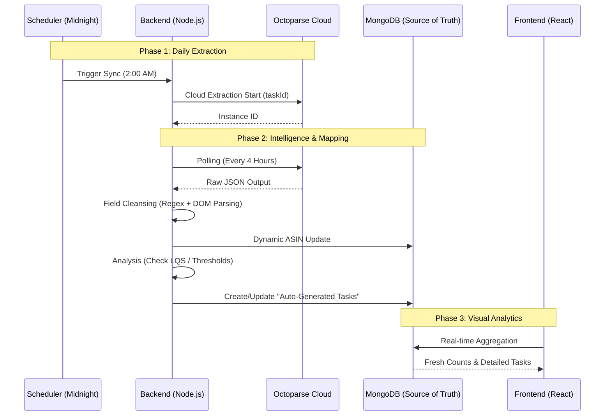

# Octoparse Integration & Automation Guide

## 🚀 Overview
The GMS Dashboard features a seamless, enterprise-grade integration with **Octoparse OpenAPI v1.0**. This system automates the lifecycle of marketplace data—from midnight cloud scraping to real-time listing quality analysis and auto-generated optimization tasks.

---

## 🏗 System Architecture

The integration follows a structured pipeline of data extraction, cleansing, and proactive task generation.

---

## 🛠 Advanced Data Mapping (`marketDataSyncService.js`)

We transform raw, messy Amazon HTML into structured business intelligence using specialized parsing logic.

| Data Point | Logic | Business Utility |
| :--- | :--- | :--- |
| **BSR (Rank)** | Regex: `/#\s*([\d,]+)/` | Tracks sales velocity trends. |
| **Bullet Points** | Counts occurrences of double-spaces or `<li>` tags. | Identifies sparse listings needing expansion. |
| **A+ Content** | Checks character depth of A+ modules. | Flips `hasAplus` flag for LQS scoring. |
| **Rating Spread** | Percentile split (5★ vs 1★). | Highlights product polarity and sentiment. |
| **Image Count** | DOM node counting in the image strip. | Flags units with < 7 images for enhancement. |

---

## 📈 Listing Quality & Auto-Tasks

The system doesn't just show data—it acts on it. When Listing Quality Scores (LQS) drop below thresholds, the **Action Engine** kicks in.

### Detailed Action Breakdown (`ActionListEnhanced.jsx`)
Auto-generated tasks now include a deep-dive sub-table view:
- **Trigger Reason**: Explicitly states why the task exists (e.g., "Title Length Below 150 chars").
- **Optimization Hint**: Provides clear instructions (e.g., "Upload lifestyle infographics").
- **Target ASINs**: Shows every specific ASIN affected by this task.

### Real-Time Seller Stats
ASIN counts on the **Seller Management** page are now **dynamically aggregated**. 
- **Old System**: Used static counters that got out of sync.
- **New System**: Performs a live MongoDB `$group` aggregation to ensure the total and active ASIN counts are 100% accurate, even after bulk deletions.

---

## 📋 Configuration

### 1. Octoparse Setup
Ensure each Seller in the dashboard has:
1.  **Octoparse API Key** (Configured in Seller Profile).
2.  **Market Sync Task ID** (The specific Task ID from Octoparse Cloud).

### 2. Automation Cron Jobs
- **Daily Start**: `0 2 * * *` (Starts cloud scraping at 2 AM).
- **Quad-Hourly Polling**: `0 */4 * * *` (Fetches new data and marks as exported).

---

> [!IMPORTANT]
> **Data Integrity**: The system uses the `/data/markexported` API call after every successful batch processing. This prevents duplicate data ingestion and ensures the database "Source of Truth" matches the latest marketplace reality.
