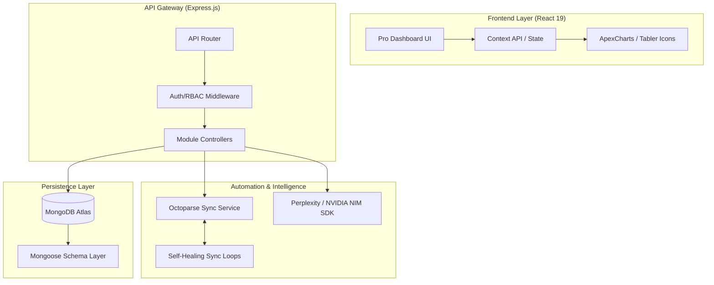

# GMS Dashboard Pro — Technical Manual & Architecture Guide

[](https://github.com/your-repo)
[](https://mongodb.com)
[](https://apexcharts.com)

GMS Dashboard Pro is an enterprise-grade **E-commerce Intelligence Platform** tailored for high-volume Amazon India operations. This document provides an exhaustive technical deep-dive into the platform's architecture, data models, automated pipelines, and intelligence layers.

---

## 🏛️ System Architecture

The platform is designed around a **Service-Oriented MERN Stack**, prioritizing data integrity, high-speed aggregations, and automated marketplace synchronization.

### 1. High-Level Ecosystem


---

## 📂 Project Structure (Full Tree)

```text
gms-dashboard/
├── backend/                # Node.js / Express Server
│   ├── config/             # DB & App Configuration
│   ├── controllers/        # Business Logic (30+ Controllers)
│   ├── cron/               # Scheduled Task Orchestration
│   ├── middleware/         # Auth, Upload, RBAC Logic
│   ├── models/             # Mongoose Schemas (33 Models)
│   ├── routes/             # REST API Definition
│   ├── services/           # External API Wrappers (Octoparse, NIM)
│   ├── uploads/            # Local Asset Storage (ASIN Images)
│   └── utils/              # Calculation & Validation Helpers
├── src/                    # React 19 Frontend
│   ├── components/         # Premium UI Component Library
│   ├── contexts/           # Global State Management
│   ├── hooks/              # Reusable Logic (API, UI)
│   ├── pages/              # Module-Specific Views
│   ├── styles/             # Zinc Design System Utilities
│   └── utils/              # Frontend formatting & UI logic
├── public/                 # Static Assets
└── package.json            # Core Dependencies (ApexCharts, Lucide, etc.)
```

---

## 🗄️ Database Strategy & Core Schemas

The system utilizes **MongoDB Atlas** for document-oriented storage, with heavy optimization for time-series data (Ads) and relational-like tracking (ASINs).

### 1. `Asin` Model (The Platform Anchor)
The `Asin` model is a sophisticated document that tracks 110+ data points including:
- **Identity**: ASIN, SKU, Seller ID, Brand, Category.
- **Market State**: `currentPrice`, `bsr`, `rating`, `reviewCount`, `soldBy`.
- **Historical Arrays**:
    - `history`: Daily snapshot of Price/BSR/Rating.
    - `weekHistory`: Week-over-week performance metrics for trend analysis.
- **Intelligent Wrappers**: `lqsDetails` (Listing Quality Score) and `feePreview` (FBA Profitability).

### 2. `AdsPerformance` Model (Attribution Engine)
Optimized for daily/monthly performance tracking:
- **Core KPIs**: Spend, Sales, Impressions, Clicks, Orders.
- **Attribution Logic**: Automated calculation of **ROAS**, **ACoS**, **CTR**, and **AOV**.
- **Indexing**: Partial unique indexes ensure zero data duplication at the `ASIN` + `Date` + `reportType` level.

### 3. `Action` & `Goal` (OKR Hierarchy)
Supports the AI-driven strategy layer:
- `Goal`: High-level business intent (e.g., "Improve Margin").
- `Action`: Decomposition of goals into trackable tasks with `Time to Complete` and `Status` loops.

---

## 🚀 Advanced Module Capabilities

### 🛡️ ASIN Manager Pro (Horizontal Layout)
The redesigned ASIN interface provides a "Mission Control" experience:
- **Horizontal Product Intelligence**: A top-bar summary housing all vital stats + live Buy Box monitoring.
- **ApexCharts Triple-Stack**:
    - **Price History**: Indigo area chart with gradient fills.
    - **BSR Trend**: Emerald line chart with **Reversed Y-Axis** (Top ranking visibility).
    - **Rating Progression**: Amber line chart for long-term customer sentiment tracking.
- **Smart Filtering**: Integrated range selectors (7D, 30D, 90D, All) that slice through historical arrays in real-time.

### 🤖 Automation Service (Octoparse Engine)
The `octoparseAutomationService` manages complex web-scraping lifecycles:
- **Self-Healing Sync**: When local data deviates from marketplace reality, the system automatically queues a background scrape.
- **Concurrent Orchestration**: Manages 100+ concurrent seller tasks with automated retry and fallback logic.
- **Data Reconciliation**: Ingests disparate marketplace results into the unified `Asin` history layer.

---

## 🧠 Intelligence & AI Layer

### 🖼️ NVIDIA NIM Image Optimization
- **SD3 Workflow**: Automatically generates high-quality lifestyle images for ASINs failing the LQS image count threshold (< 7).
- **Automation**: Triggered directly from the ASIN Manager when "Image Optimization" is required.

### 🎯 Perplexity AI OKR Engine
- **Decomposition**: Uses advanced LLM prompts to split vague intentions into 4-week execution plans.
- **Validation**: Ensures every task generated is measurable against marketplace KPIs (ACoS, ROAS).

---

## 🛠️ API Reference & Key Endpoints

### `asinController.js`
- `GET /api/asins`: Unified list with seller filtering and aggregation.
- `PATCH /api/asins/:id`: Partial updates for LQS and marketplace status.
- `POST /api/asins/sync`: Manual trigger for the Octoparse orchestration.

### `uploadController.js`
- `POST /api/upload/ads-data`: Complex CSV parser with **Case-Insensitive Header Mapping** supporting standard Amazon Advertising reports.

---

## 🚀 DevOps & Maintenance

### 1. Environment Management
- Production-grade `.env` includes secrets for **Clerk Auth**, **Keepa SDK**, **Octoparse API**, and **NVIDIA NIM**.

### 2. Performance Optimization
- **MongoDB Indexing**: Compound indexing on `asinCode + seller` and `date + reportType` ensures sub-100ms query performance on 1M+ records.
- **Vercel Edge Rendering**: The frontend is optimized for zero-latency loading of massive DataTables.

---

## 🎨 Design System: Zinc Pro
Built on a bespoke design system focusing on **Clarity and Precision**.
- **Typography**: Inter (UI) / Outfit (Header) for maximum readability.
- **Grid**: 24px unified corner-radius system.
- **Effects**: 12px Backdrop Blur (Glassmorphism) for focused detail modals.

---

## 📄 License & Proprietary
© 2026 Easysell Projects. Distributed under the ISC License. 
Confidential and Proprietary. All Rights Reserved.
